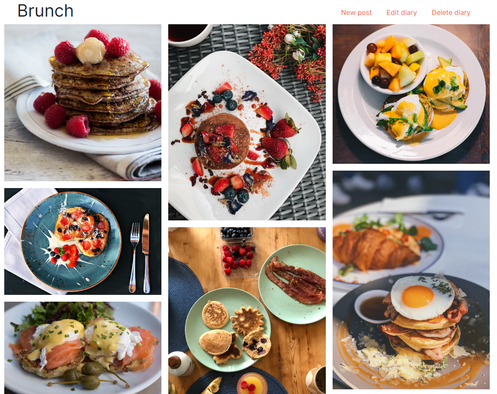

#  Foodie
Foodie is a responsive CRUD application for creating food diaries. Posts are added to diaries to 
display images in a masonry grid.



##  Technologies
* EJS
* Express
* MongoDB
* Bootstrap

##  Build
1.  Create a `.env` file with the following:
    ```
    MONGODB_URI=<your MongoDB URI>
    SESSION_SECRET=<your secret>
    ```
2. Run `npm run start`

Try it out at `localhost:3000`.